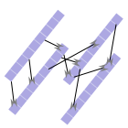

# streamdice

 

A [stream cipher](https://en.wikipedia.org/wiki/Stream_cipher) developed by Andrew Garcia based on catalogued shuffled keyboards. 

A cipher is an encryption algorithm and thus, can be applied to program development in
any language. Originally developed in [Python](./python) and optimized to C++ as [**streamdice**](./streamdice). The JavaScript implementation [**streamdiceJS**](./streamdiceJS) was written to integrate to websites as an [interactive application](https://andrewatcloud.com/streamdice/). 

| [Read the white paper](https://andrewatcloud.com/streamdice/whitepaper.pdf) |
| -------------------------------------------------------------------------------------------- |

| [Check out the online demo](https://andrewatcloud.com/streamdice/) |
| ------------------------------------------------------------------ |

### Contributions Welcome / Hacktoberfest

Meaningful contributions to the project are always welcome. Participating in Hacktoberfest 2022. Before making a PR, please make sure to read the [CONTRIBUTING](./CONTRIBUTING.md) document.

You may use the Issues section of this repository if you'd like to propose some new ideas/enhancements or report a bug.

### Disclaimer: Use At Your Own Risk

This program is free software. It comes without any warranty, to the extent permitted by applicable law. You can redistribute it and/or modify it under the terms of the MIT LICENSE, as published by Andrew Garcia. See [LICENSE](https://github.com/andrewrgarcia/streamdice/blob/main/LICENSE) for more details.

**[MIT license](./LICENSE)** Copyright 2022 © <a href="https://github.com/andrewrgarcia" target="_blank">Andrew Garcia</a>.

