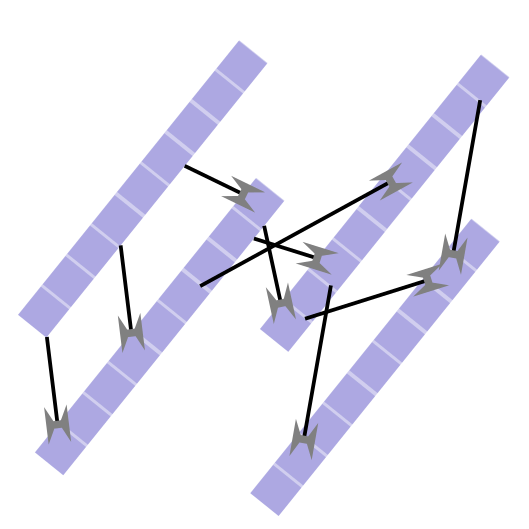

Welcome to the documentation page of streamdice
===================================================

A `stream cipher <https://en.wikipedia.org/wiki/Stream_cipher>`_ developed by Andrew Garcia based on catalogued shuffled keyboards. 

A cipher is an encryption algorithm and thus, can be applied to program development in
any language. Originally developed in Python and optimized to C++ as **streamdice**. 
The JavaScript implementation **streamdiceJS** was written to integrate to websites as an interactive application. 

Read the white paper: :doc:`whitepaper`

Check out the :doc:`usage` section for further information, including how to :ref:`installation` the project. For some quick examples / templates, check out the next section. 

Contents
--------

.. toctree::

   usage
   api

Whitepaper
-----------------------

.. toctree::

   whitepaper