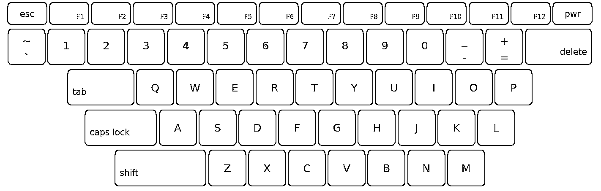
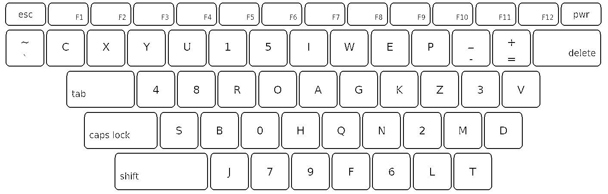
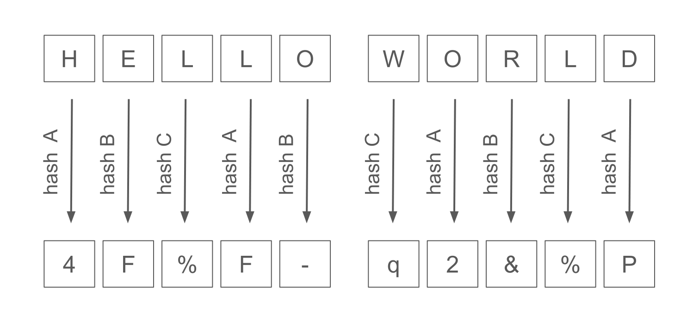

Streamdice: An encryption algorithm based on catalogued shuffled keyboards
=================================================================================

**Andrew R. Garcia**

garcia.gtr@gmail.com

.. 
  last web revision: Dec 2022
  revised as whitepaper: Mar 2023

Abstract
-------------------------------

ImageMesh is a method available in versions :math:`\ge` 2.0 of the voxelmap Python library that generates 3D models from images using Convex Hull in 3-D to enclose external 
points obtained from a series of partitioned point clouds. These point clouds are generated by assigning the relative pixel intensities from the partitioned images 
as the depth dimension to the points. In this paper, we describe the limitations of the original ImageMesh method and the quick solution we have implemented to address them. 
Additionally, we introduce MeshView, a Python visualization tool developed in tandem with ImageMesh that provides a convenient way to visualize the 3D models generated by ImageMesh.
Finally, we discuss the GPU memory space complexity of both methods.

Good encryption can be used to protect data and private information.
When properly encrypted, even if data is accessed in an unauthorized manner or unwillingly 
disclosed, the non-consented reader will be unable to read it without the correct encryption keys. 
The algorithm presented here, **streamdice**, is a stream cipher which encrypts 
characters (i.e. letters, numbers and some allowed signs) by both their specific identity 
as well as their relative location in the message thread. For streamdice, the stream units
are shuffled keyboards generated by a pseudo-random number generator (PRNG), each of which 
are shifted once for every single encrypted character. The shuffled keyboards are limited 
and kept in memory with hashes, which are in turn dependent on the provided keys 
for encryption. The pseudo-random factor obfuscates the periodicity of the algorithm,
and the encryption operations make it challenging to exploit by brute force. 

Method
-------------

This method uses a hashmap where each one of its keys corresponds to an index of the keyboard character representing it in QWERTY order. 
For instance, the first keys for Q, W, and E characters are 1, 2 and 3, respectively. This ordered arrangement is analogous to a symbolic 
keyboard as the one in Figure 1.

  Standard QWERTY keyboard

For the encryption, the character values of the hashmap are shuffled with a pseudo-random number generator (PRNG) seeded by a "hash" number. 
For instance, shuffling the original keyboard in Figure 1 with a Mulberry32 PRNG and a #5443 hash will give the shuffled keyboard in Figure 2. 
Because the values are shuffled, the keys will be preserved, and thus the ciphertext can be transformed back by reference to the original keyboard, i.e. 

.. math::
    
    H23\text{(ciphertext)} \rightarrow [4,2,13]\text{(indices)} \rightarrow tea\text{(text)} \\

  Randomly-shuffled keyboard with \#5443 

    
The keyboard is shuffled each time a new character is encrypted with N permutations, 
calling a new shuffling operation by its PRNG hash as shown in Figure 3. As seen in the same figure, the permuted keyboards repeat periodically
if the number of keyboards is less than the number of characters to encrypt. The specific hashes are computed directly from the 2 keys provided by the user
for the encryption. An :math:`\mathbf{H}` vector contains all the :math:`\mathrm{H_i}` hashes used to generate the shuffled keyboards. The :math:`N` number of 
:math:`\mathrm{H_i}`
hashes is equal to the number of digits provided for :math:`\mathrm{key_2}` and are computed in the following way:

.. math::
    
    \Gamma_i &=  (\mathrm{key_2} // 10^{i}) \% 10 \\
    \mathrm{H_i} &= \mathrm{key_1}  + \Gamma_i

The hashes used to generate the new keyboard, rather than the specific keyboard arrangement, are the objects kept in memory throughout the encryption.
As suggested above, the decryption takes the keys used to encrypt the messages and reverses the protocol. This method, thus, optimizes auxiliary space, 
:math:`\mathcal{O}(N)`, rather than encryption time complexity, :math:`\mathcal{O}(MC)`, where :math:`N` is the number of digits of the :math:`key_2`,
while :math:`M` and :math:`C` are the message length and number of keyboard characters to encrypt, respectively.

  Encrypting *hello world* with a periodically-repeating stream of 3 shuffled keyboards.

